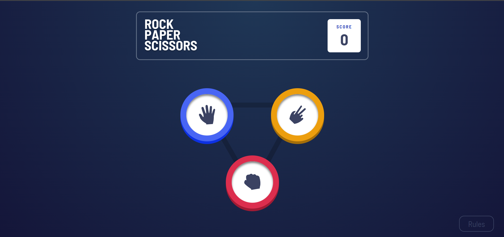

[PATİKA PROFILE URL](https://app.patika.dev/fatihdelice)

# Taş Kağıt Makas Oyunu
Aşağıda kuralları belirtilen taş kağıt makas oyununu geliştirmeniz gerekiyor.

## Kurallar
- Taş, makası kırarak yener.
- Kağıt, taşı sararak yener.
- Makas, kağıdı keserek yener.

##  Gereksinimler
- [x] Oyun, bilgisayara karşı oynanacak şekilde hazırlanmalıdır.
- [x] Ekranda görüntülenecek olan taş, kağıt ve makas butonlarına tıklanarak bir seçim yapılmalı. Ardından bilgisayarın rastgele bir seçim yapması sağlanarak turu kazanan belirlenmeli.
- [x] Turu kazanan bilgisayar ise skor tabelasından bir puan eksiltilmeli, aksi halde bir puan eklenmeli. Yapılan seçimler aynıysa skora herhangi puan yansımaz.
- [x] Skor tabelasında 3 rakamı göründüğünde biz, -3 göründüğünde ise bilgisayar kazanmış olur.
- [x] Tur geçmişi ekranda listelenmeli, hangi turu kimin kazandığı görüntülenebilmeli.

## Screenshot

